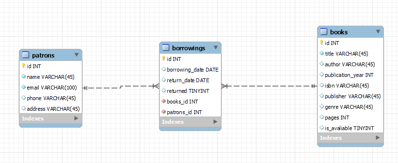

Library Management System

This is a simple Library Management System built with Java, Spring Boot, and Maven.

## Table of Contents

- [Getting Started](#getting-started)
- [Prerequisites](#prerequisites)
- [Usage](#usage)
- [How to Run](#how-to-run)
- [Features](#feachers)
- [Database](#database)
- [API Endpoints](#api-endpoints)

## Getting Started

These instructions will get you a copy of the project up and running on your local machine for development and testing purposes.

## Prerequisites

- Java 21
- Maven
- IntelliJ IDEA

## Usage

Once the server is running, you can interact with the API at `http://localhost:8080/api`.

## How to Run

1. Clone the repository to your local machine.
2. Navigate to the project directory in your terminal.
3. If you have Maven installed, you can run the application using the following command:

```bash
mvn spring-boot:run
```

## Features

### Authentication

The application uses Spring Security for authentication. It is configured in the `SecurityConfig` class. Here's a brief description of how it works:

1. **UserDetailsService**: This is a core interface in Spring Security which is used to retrieve user-related data. The application uses an `InMemoryUserDetailsManager`, which is a simple in-memory UserDetailsService that comes with Spring Security. There are two users defined, `user1` and `user2`, both with the password `123456` and the role `USER`.

2. **PasswordEncoder**: This is used to encode the passwords. The application uses `BCryptPasswordEncoder`, which is a password encoder that uses the BCrypt strong hashing function. When a password is encoded, it is generally impossible to decode it back to its original value. This is a good practice for storing passwords securely.

3. **SecurityFilterChain**: This is where the security rules are defined. The application uses HTTP Basic authentication, which is a simple authentication scheme built into the HTTP protocol. The client sends the user name and password as unencrypted base64 encoded text. It's generally recommended to use HTTPS in conjunction with Basic Authentication to ensure the credentials are not exposed in transit.

   The application is configured to require authentication for all requests that match the pattern `/api/**`. All other requests are permitted without authentication. CSRF protection is disabled, which is not recommended for a production application as it leaves your application vulnerable to cross-site request forgery attacks.

In a typical scenario, when a request is made to a protected endpoint, the server will respond with a 401 Unauthorized status if the request does not include valid authentication credentials. The client must then reissue the request with an Authorization header that includes the credentials for a valid user.

### Aspects
Implement logging using Aspect-Oriented Programming (AOP) to log method calls, exceptions, and performance metrics of certain operations like book additions, updates, and patron transactions.

### Caching
Utilize Spring's caching mechanisms to cache frequently accessed data, such as book details or patron information, to improve system performance.

### Transaction Management
Implement declarative transaction management using Spring's @Transactional annotation to ensure data integrity during critical operations.

### Testing
- Write unit tests to validate the functionality of API endpoints.
- Use testing frameworks like JUnit, Mockito, or SpringBootTest for testing.

## Database
- ER Diagram
- 

## API Endpoints

### Borrow a Book

- **URL:** `/api/borrow/{bookId}/patron/{patronId}`
- **Method:** `POST`
- **Controller:** `BorrowingsController`
- **Method:** `borrowBook(Long bookId, Long patronId)`

### Return a Book

- **URL:** `/api/return/{bookId}/patron/{patronId}`
- **Method:** `PUT`
- **Controller:** `BorrowingsController`
- **Method:** `returnBook(Long bookId, Long patronId)`

### Get All Books

- **URL:** `/api/books`
- **Method:** `GET`
- **Controller:** `BookController`
- **Method:** `getAllBooks()`

### Get Book by ID

- **URL:** `/api/books/{id}`
- **Method:** `GET`
- **Controller:** `BookController`
- **Method:** `getBookById(Long id)`

### Add a Book

- **URL:** `/api/books`
- **Method:** `POST`
- **Controller:** `BookController`
- **Method:** `addBook(Book book)`

### Update a Book

- **URL:** `/api/books/{id}`
- **Method:** `PUT`
- **Controller:** `BookController`
- **Method:** `updateBook(Long id, Book book)`

### Delete a Book

- **URL:** `/api/books/{id}`
- **Method:** `DELETE`
- **Controller:** `BookController`
- **Method:** `deleteBook(Long id)`

### Get All Patrons

- **URL:** `/api/patrons`
- **Method:** `GET`
- **Controller:** `PatronController`
- **Method:** `getAllPatrons()`

### Get Patron by ID

- **URL:** `/api/patrons/{id}`
- **Method:** `GET`
- **Controller:** `PatronController`
- **Method:** `getPatronById(Long id)`

### Add a Patron

- **URL:** `/api/patrons`
- **Method:** `POST`
- **Controller:** `PatronController`
- **Method:** `addPatron(Patron patron)`

### Update a Patron

- **URL:** `/api/patrons/{id}`
- **Method:** `PUT`
- **Controller:** `PatronController`
- **Method:** `updatePatron(Long id, Patron patron)`

### Delete a Patron

- **URL:** `/api/patrons/{id}`
- **Method:** `DELETE`
- **Controller:** `PatronController`
- **Method:** `deletePatron(Long id)`
